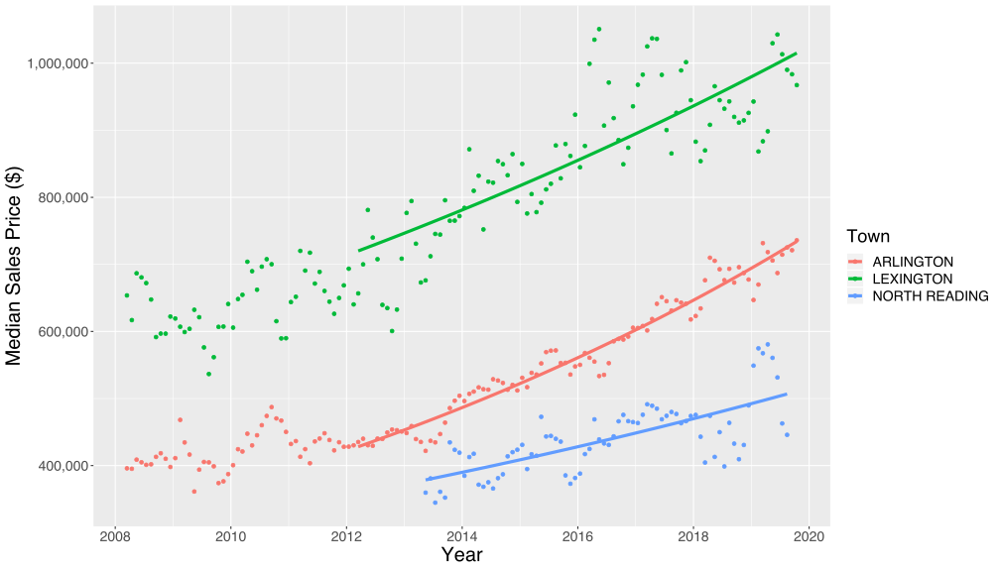
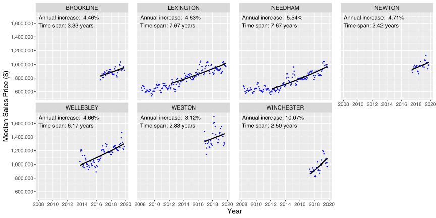

# Introduction

I've been thinking a lot lately about the Boston, MA housing market.  As a long-time renter who lives in the area, I'd like to buy a house, preferably sooner rather than later.  However, the most recent Federal Reserve [Case-Shiller index](https://fred.stlouisfed.org/series/BOXRSA) shows a 45% price increase for the seven year period from late 2012 to late 2019, effectively a roughly 5.5% / year annualized rate of growth, compounded annually for seven years in a row.  This statistic worries me, because although the local economy and labor market around here has been robust during most of that period, I don't know anybody who's been regularly receiving 5%-6% annual raises for years on end.  I remember my own salary in 2012, and although it's gone up a bit during that time, it hasn't risen anywhere near 45%.  

Having lived through the last real estate bubble, from roughly the late 1990s until 2006 or so, this scenario looks familiar to me.  This time, however, there's a difference: when the last bubble peaked, the [Federal Funds](https://fred.stlouisfed.org/series/FEDFUNDS) interest rate was 5%, and that gave the cabal of economic planners that sets our interest rates the ability to respond to plunging house prices in part by cutting those rates almost to zero--ultimately leaving them at zero until 2016.  Nowadays, as I'm writing this in Jan 2020, the federal funds rate is around 1.5%.  That means that if there's another financial panic like the one that we saw in 2008, and house prices nosedive again, this time there's a lot less room for economic planners to maneuver.  I'm frankly a little terrified of putting down a 20% down payment that took me years of saving to accumulate, only to watch all of my equity suddenly disappear in an economic [black swan event](https://en.wikipedia.org/wiki/Black_swan_theory) as house prices reset to a more traditional relationship with wages, while policy planners are powerless to intervene.

However, despite my concerns, life moves on, and I don't want to sit on the sidelines living as a renter forever.  So I've decided to explore whether it's possible to limit my exposure to the price bubble somewhat by investigating if there are towns in the Boston metro region where the effects have been less pronounced.  Ideally, I'd like to find local communities where:

* the rate of price growth over the past several years has been below the Case-Shiller ~5.5% average (on the assumption that prices which have been more stable on the way up may be more stable on the way down)
* the average price point is sowehat modest for the Boston area to begin with (so that I don't sink too much of my net worth into an "investment" that ultimately ends up owning me)

Other factors obviously matter too of course: I'd like to live in a walkable community with good schools, near public transit and major freeways, but those concerns are beyond the scope of this analysis.

# Methodology

To explore how Boston house prices have evolved in various local communities over time, I integrated two data sets:

* Zillow seasonally adjusted [house sale prices](https://www.zillow.com/research/data/), aggreagated by city
* MassGIS [town boundary](https://docs.digital.mass.gov/dataset/massgis-data-community-boundaries-towns-survey-points) GIS shapefiles

I started by regression fitting a compounding annual growth function to the house sale price time series data for each Massachusetts city in the Zillow data set:

where:

*  = Starting price at some arbitrary starting time 
*  = Time, in years
*  = Annual percentage rate of price growth

Here's an example showing the raw data, with fitted curves superimposed, for three arbitrarily selected Boston suburbs:

Here's a more detailed example showing data and growth rate fit results for a large number of Massachusetts towns and cities (right-click on image to open and zoom):

And here's another showing the same results for the most expensive locations:

