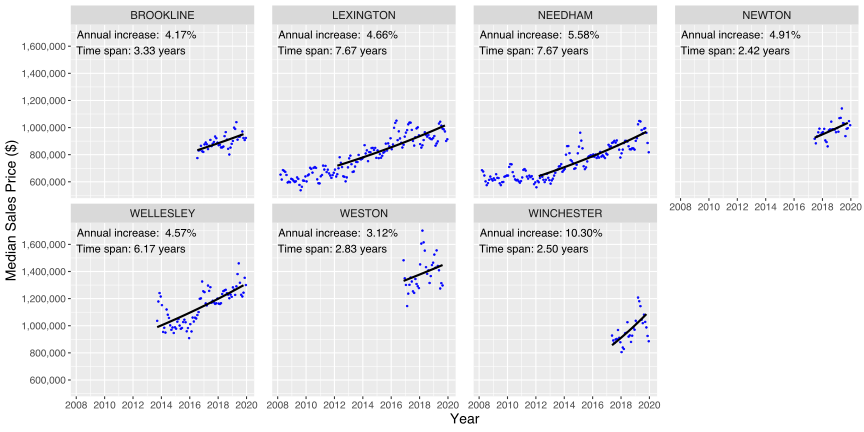

Last revised: Thu, Jan 16, 2020 by [stachyra](https://github.com/stachyra)

# Introduction

I've been thinking a lot lately about the Boston, MA housing market.  As a long-time renter who lives in the area, I'd like to buy a house, preferably sooner rather than later.  However, the most recent Federal Reserve [Case-Shiller index](https://fred.stlouisfed.org/series/BOXRSA) shows a 45% price increase for the seven year period from late 2012 to late 2019, effectively a roughly 5.5% / year annualized rate of growth, compounded annually for seven years in a row.  This statistic worries me, because although the local economy and labor market around here has been robust during most of that period, I don't know anybody who's been regularly receiving 5%-6% annual raises for years on end.  I remember my own salary in 2012, and although it's gone up a bit during that time, it hasn't risen anywhere near 45%.  

Having lived through the last real estate bubble, from roughly the late 1990s until 2006 or so, this scenario looks familiar to me.  This time, however, there's a difference: when the last bubble peaked, the [Federal Funds](https://fred.stlouisfed.org/series/FEDFUNDS) interest rate was 5%, and that gave the cabal of economic planners that sets our interest rates the ability to respond to plunging house prices in part by cutting those rates almost to zero--ultimately leaving them at zero until 2016.  Nowadays, as I'm writing this in Jan 2020, the federal funds rate is around 1.5%.  That means that if there's another financial panic like the one that we saw in 2008, and house prices nosedive again, this time there's a lot less room for economic planners to maneuver.  I'm frankly a little terrified of putting down a 20% down payment that took me years of saving to accumulate, only to watch all of my equity suddenly disappear in an economic [black swan event](https://en.wikipedia.org/wiki/Black_swan_theory) as house prices reset to a more traditional relationship with wages, while policy planners are powerless to intervene.

However, despite my concerns, life moves on, and I don't want to sit on the sidelines living as a renter forever.  So I've decided to explore whether it's possible to limit my exposure to the price bubble somewhat by investigating if there are towns in the Boston metro region where the effects have been less pronounced than average.  Ideally, I'd like to find local communities where:

* the rate of price growth over the past several years has been below the Case-Shiller ~5.5% yearly average (on the assumption that prices which have been more stable on the way up may be more stable on the way down)
* the average price point is sowehat modest for the Boston area to begin with (so that I don't sink too much of my net worth into an "investment" that ultimately ends up owning me)

Other factors obviously matter too of course: I'd like to live in a walkable community with good schools, near public transit and major freeways, but those concerns are beyond the scope of this analysis.

# Methodology

To explore how Boston house prices have evolved in various local communities over time, I integrated two data sets:

* Zillow seasonally adjusted [house sale prices](https://www.zillow.com/research/data/), aggreagated by city
* MassGIS [town boundary](https://docs.digital.mass.gov/dataset/massgis-data-community-boundaries-towns-survey-points) GIS shapefiles

## Price Variation Over Time

Unfortunately, the Zillow data does not include successive sale price data for individual homes, so the highly robust Case-Shiller methodology, which analyzes price changes for repeat sales of the same house, cannot be applied here.

As a somewhat less robust approach that I could apply to the data set that I actually have, I instead began by regression fitting a compounding annual growth function to the house sale price time series data for each Massachusetts city that Zillow tracks:

where:

* *P*0 = Starting price at some arbitrary starting time *t*0
* *t* = Time, in years
* *r* = Annual percentage rate of price growth

Here's an example showing the raw data, with fitted curves superimposed, for three arbitrarily selected Boston suburbs:

Here's a more detailed example showing data and growth rate fit results for a large number of Massachusetts towns and cities (right-click on image to open and zoom):

And here's another showing the same results for the most expensive locations:

## Price Variation Across Geography

To better visualize how house prices and annual growth varied from town to town, I made a series of choropleths maps.  Here's a map showing average house price for several dozen Boston suburbs during the 6 month period from May 2019 - Oct 2019:

and here's another map showing average annual price growth rate from Mar 2012 - Oct 2019 (or for shorter periods, in cases where data was not available over the full time range):

I also made a pair of similar maps for the entire state of Massachusetts, since it was not much more extra work to do:

# Weird Stuff

One unexpected result of these plots was that both prices as well as price growth in Cambridge, MA, a community that I visit frequently and am very familiar with, look much tamer than I had expected.  However, I think may I know what's going on there: in their [methodology](https://www.zillow.com/research/home-sales-methodology-7733/) discussion, Zillow mentions that the house prices in their data sets are a combination of "single family, condominium, and cooperative properties".  This has the result that price comparisons between towns are not as meaningful if the average *mix* of such properties is not constant across locations, because condominiums, which are very common in the Boston area, can be as much as half the price of a single family house in towns with the highest population densities--where land value is at a premium.  In my experience looking at Cambridge real estate ads, a relatively modest (by national standards) single family home there can often cost $1-$2 million dollars, far more costly than these plots would suggest.  And in my experience biking, driving, and walking through Cambridge over the past several years, I've noticed lots of new multi-unit dwellings under construction.  I suspect what's going on here is that as potential buyers are priced out of the single family home market in Cambridge, new condos are being built over time, and these are beginning to account for an increasingly large share of inventory.  As a result, it skews both the prices as well as the price growth rate lower than they would have otherwise been if one were to compare only single family homes, which are still the predominant property type in most communities outside of Cambridge and Boston.  Note that a true Case-Shiller analysis, which proceeds at a much more granular level by analyzing repeat sales data for individual houses, would not be fooled by this type of issue.

# Conclusions

Despite the fact my methodology is not as robust as a true Case-Shiller analysis, nevertheless, for most towns, I still believe it's likely to be reasonably close to a correct.  One unhappy insight is that Arlington, where I now live and which I very much like, seems to have appreciated significantly faster than average: around 7.4% over 7+ years.  The result is that a median-priced house in Arlington, which used to cost a bit over $400,000 in early 2012, now costs more than $700,000--approximately a ~70% price increase.  Having lived in the area during the entire period of price appreciation, I know for a fact that wage gains haven't come anywhere close to that figure during the same period.  As a result, I'm beginning to think it may be safer to buy elsewhere--Arlington looks like it's experiencing a price bubble which in the long term is probably not going to be sustainable.  

# Code

The plots published above were developed in R, with heavy reliance on packages from the [tidyverse](https://www.tidyverse.org/).  Source code is available [here](https://github.com/stachyra/realestate_prices).
